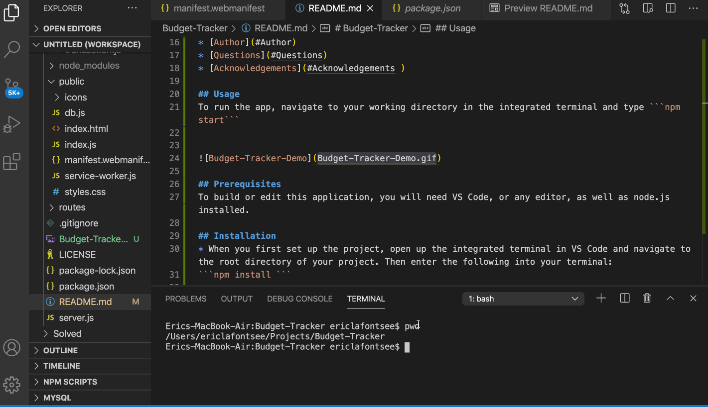

# Budget-Tracker

## Description
For this project, I was provided a working Budget Tracker application. My job was to  
add offline functionality. When the network is unavaiable, the user can make   
offline deposits and expenses. When the app reconnects to the network,   
the offline entries are added to the tracker. This app utilized a service-worker.js,   
a manifest file, and indexDB to create this offline experience.

## Table Of Contents
* [Usage](#Usage)
* [Prerequisites](#Prerequisites)
* [Installation](#Installation)
* [BuiltWith](#Built-With)
* [License](#License)
* [Author](#Author)
* [Questions](#Questions)
* [Acknowledgements](#Acknowledgements )

## Usage
To run the app, navigate to your working directory in the integrated terminal and type ```npm start```




## Prerequisites
To build or edit this application, you will need VS Code, or any editor, as well as node.js installed.

## Installation
* When you first set up the project, open up the integrated terminal in VS Code and navigate to the root directory of your project. Then enter the following into your terminal:  
```npm install ```

## Built-With
Node.js  
JavaScript  
MongoDB  
Mongoose  
Express  
HTML  
CSS  
Bootstrap
Font Awesome

## License 
This project is licensed under MIT. 


## Author
Eric LaFontsee 

## Questions
If you have any additional questions you can contact me here:  
GitHub: https://github.com/ericlafontsee   
elafontsee@gmail.com

## Acknowledgements 
* Public files, server.js, routes, and models provided by Trilogy  
* Worked on this project with Brendon Conatser


 


